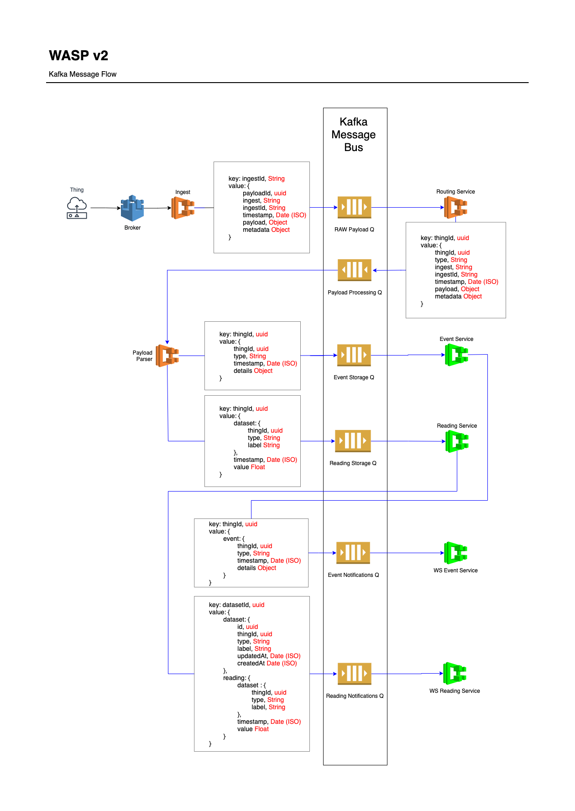

# Kafka Message Flow

This page describes the flow of messages sent to and consumed from Kafka by each service through WASP.

## Diagram

 
 Examples of repos for the microservices in the diagram

 - Ingest: [`wasp-ingest-mqtt`](https://github.com/digicatapult/wasp-ingest-mqtt), [`wasp-ingest-nordic-cloud`](https://github.com/digicatapult/wasp-ingest-nordic-cloud)
 - [`wasp-routing-service`](https://github.com/digicatapult/wasp-routing-service)
 - Payload Parser: [`wasp-deti-power`](https://github.com/digicatapult/wasp-deti-power), [`wasp-thingy91`](https://github.com/digicatapult/wasp-thingy91)
 - [`wasp-event-service`](https://github.com/digicatapult/wasp-event-service) & [`wasp-reading-service`](https://github.com/digicatapult/wasp-reading-service)
- [`wasp-ws-event-service`](https://github.com/digicatapult/wasp-ws-event-service) & [`wasp-ws-reading-service`](https://github.com/digicatapult/wasp-ws-reading-service)

## Partitioning

### Keys
Kafka manages horizontal scaling by splitting topics into partitions. This lets multiple, different producers simultaneously write to the same topic, as each message can be sent to a different partition. WASP sets Kafka partitions by key, meaning a message with a specific key will always go to the same partition (however, that partition can be used for more than one key). This ensures the messages stay in chronological order. WASP has been set up this way to optimise for a large number of devices sending small messages, a different partitioning strategy may need to be used if devices are sending large amounts of data such as video.

The type of key used at each queue is annotated in the [flow diagram](##Diagram).

### Topic configuration
WASP uses Helm to deploy its services with Kubernetes. Kafka config values are set in `helm/SERVICE_NAME/values.yaml`, then used (via `configmap.yaml`) when creating each topic in `helm/SERVICE_NAME/templates/deployment.yaml`. In WASP, message consumers create the topics they read from e.g. `raw-payloads` is initiated by `wasp-routing-service` and not an ingest service such as `wasp-ingest-nordic-cloud`.

Depending on the throughput and reliability required, topics across WASP are set to have:
- Between 5-15 partitions.
- A replication factor of between 1-3. 

Kafka instances are also created when testing using `docker-compose`. For simplicity, the topics are usually created with a single partition and a replication factor of 1.